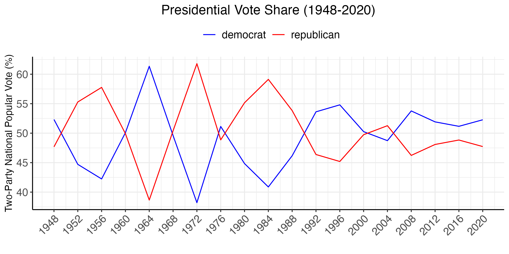
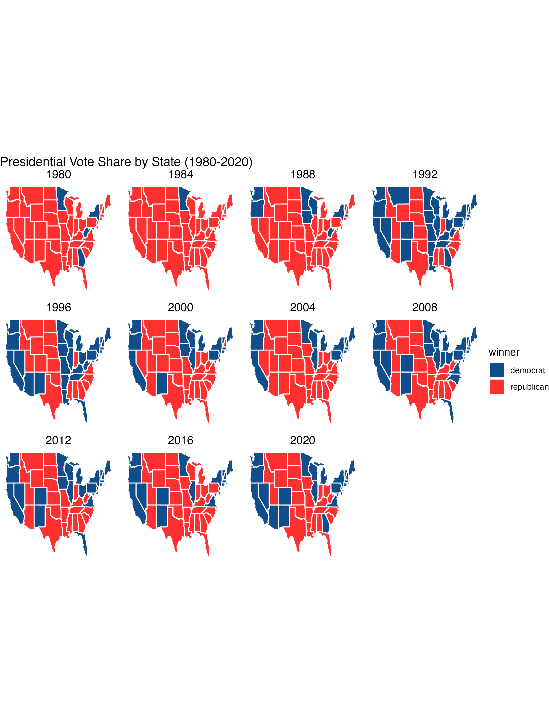
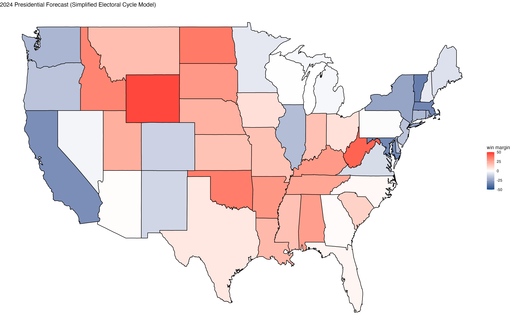
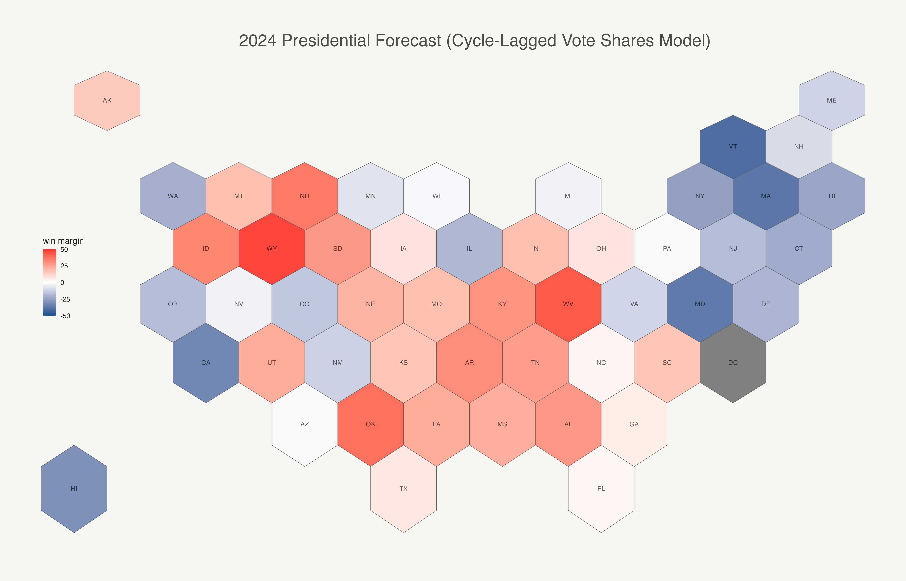

# Introduction: Past Presidential Election Results
## August 30, 2024

Predictions of the future are based on the patterns of the past. If X tended to predict Y well in the past, we would want to use that X in our model. So we start our journey by looking into past presidential election results -- first at the national level. 

**Elections are generally competitive between the two parties.** One thing in particular stands out: in the last 60 or so years, the race for the presidency has overall been remarkably competitive between the two major parties. Since FDR, neither Republicans nor Democrats have maintained a monopoly over the White House:



The first half of the twentieth century experienced greater swings and greater margins of victory, while point spreads in the last 20 years have been less than 10 points. The three <u>closest</u> elections in the last 60 years and their "prevailing narratives" are:

* **2000, margin of `0.5%` or 500k votes or `5 EV` (Bush vs. Gore).** Gore managed to distance himself from Clinton's scandals (which put him neck-and-neck with Bush); though, really, this was anyone's election.

* **1968, margin of `0.7%` or 500k votes or `110 EV` (Nixon vs. Humphrey).** As the South began to re-align, Nixon's [Southern Strategy](https://en.wikipedia.org/wiki/Southern_strategy) appealed to whites in the South; beginning of the "culture wars" which favored the Republicans in rural areas; protests against Humphrey for his unpopular pro-war position.

* **1960, margin of `0.7%` or 120k votes or `84 EV` (JFK vs. Nixon).** The Republican party was hurt by the 1958 recession (we'll talk about this more when we read [The Message Matters](https://www.amazon.com/Message-Matters-Economy-Presidential-Campaigns/dp/0691139636)); JFK mobilized a new cohort of Catholic voters; JFK campaigned wisely in key swing states. 

Similarly, the three biggest <u>landslides</u> in the last 60 years and their "prevailing narratives" are:

* **1984, margin of `18.2%` or 17 million votes or `512 EV` (Reagan vs. Mondale).** Reagan enjoyed a post-recession economic recovery; Reagan was an effective ''soundbite'' generator in debates and on the campaign trail.

* **1972, margin of `23.5%` or 18 million votes or `503 EV` (Nixon vs. McGovern).** The Republican party was helped by a strong economy; the Republicans continued the Southern Strategy which massively appealed to a newly re-aligned South; McGovern's VP's depression was considered a scandal.

* **1964, margin of `22.6%` or 16 million votes or `434 EV` (Johnson vs. Goldwater).** JFK's assasination considered a shock sympathetic to Dems; despite the beginnings of re-alignment Goldwater portrayed as an extremist in media and campaigns; Johnson's Great Society and civil rights reforms were enormous policy achievements.

We will explore this semester what empirical evidence we really have for these "prevailing narratives" and whether they generalize beyond these races.

**A winner-take-all system with electors based on population distorts win margins.** We note another set of observations around *the winner's popular vote*. First, very famously in two races, the winner of the popular vote lost the election: Al Gore in 2000 and Hillary Clinton in 2016. This is a reflection of how *each* popular vote for a candidate is not equally valuable to their electoral victory because of the electoral college. The <u>state</u> where it is won matters. 

For example, winning 25 million votes in California (a state with ~30 million voting-age citizens) is impressive but unnecessary to beat your opponent and win its 55 electoral votes (`EV`). Instead, it would be better if a candidate just won a slim majority of 15 million votes in California (`55 EV`), a slim majority of 5.1 million votes in Pennsylvannia (`20 EV`), and a slim majority of 4.5 million votes in North Carolina (`15 EV`). That's the same 25 million votes, but in one scenario a candidate wins `55 EV` while in the other a candidate wins `90 EV`. Whoa! 

This is an illustration of the distortions of a *winner-takes-all* electoral system where slim majorities in just a few moderately large states (which promise substantial EVs!) translate to huge electoral gains. Empirically, it ends up that electoral college vote margins [are more dramatic](https://www.pewresearch.org/fact-tank/2016/12/20/why-electoral-college-landslides-are-easier-to-win-than-popular-vote-ones/) than popular vote margins. This is why presidential candidates tend to (mostly) focus their resources on moderately large swing states where they can win by a slim majority rather than firing up the base or purusing lost causes. 

Below we can see which states vote blue/red and how consistently so. In section, we will produce more nuanced versions of these maps that highlight ''swinginess'' of various states.



**Prediction 1: using past election returns.** Noting from the first figure the general competitiveness of elections, we might infer that the best way to predict this year's election in each state is looking at the two *most recent* electoral cycles. This is the simple but central engine of the [Helmut Norpath electoral cycle model](https://www.pollyvote.com/pollyvote-election-forecasting/naive-forecast/). 

I will predict 2024 election state-by-state election outcomes, for each state `i` using a simplified version of this model by taking a weighted average of the past two election popular vote returns: 

```
presvoteshare2024_i = (presvoteshare2020_i x 0.75) + (presvoteshare2016_i x 0.25)
```

See [the related R script to replicate this analysis](../scripts/01_Intro_Lab_Blog_Code.R). The figure below shows the state-by-state forecasts:



(Note that this map could be better labelled!)

If we go off this naïve, historically weighted model, Trump is expected to win a number of key battleground states: Arizona (`+0.7%`), Georgia (`+1.15%`), North Carolina (`+2.0%`), Florida (`+2.9%`), and Ohio (`+8.5%`). On the other hand, Harris is favored to win a fair share of battleground states including Wisconsin (`+0.3%`), Pennsylvannia (`+0.7%`), Michigan (`+2.1%`), Nevada (`+2.5%`), New Hampshire (`+5.7%`), Minnesota (`+5.9%`), and Maine (`+7.8%)`. 

Altogether, that spells out `276 EV` for Harris and `262 EV` for Trump in November.

**Prediction 2: using past election returns and OLS.** We can also estimate simple bivariate and multivariate linear regressions using past electoral cycle returns. The first model uses vote share from the previous electoral cycle (2020) to predict the 2024 vote using simple OLS as follows: 
$$ 
Y{2024}_i = \beta_0 + \beta_1 {X_{{vote_share_2020}_i}} + \epsilon
$$

Using these models, I obtained the following Electoral College vote predictions: 


| Predictor Type                 | Harris | Trump |
|--------------------------------|--------|-------|
| One Lagged Cycle Predictor     |   226  |  312  |
| Two Lagged Cycle Predictors    |   247  |  291  |





